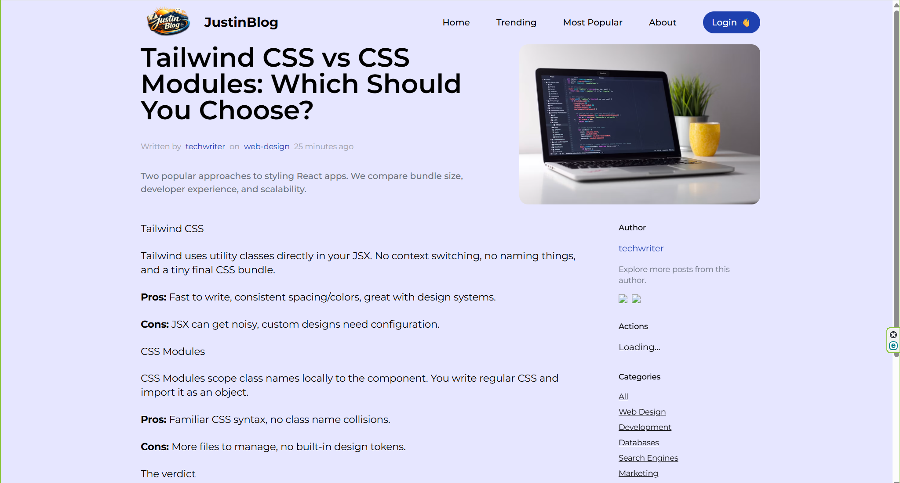

# JustinBlog

A full-stack blog application built with React 19, Express 5, and MongoDB.

## Screenshots

### Homepage


### Single Post


## Tech Stack

**Frontend**
- React 19
- Vite
- Tailwind CSS
- React Router v6
- TanStack Query
- ImageKit (image uploads)

**Backend**
- Express 5
- MongoDB + Mongoose
- JWT (HttpOnly cookies)
- bcryptjs
- ImageKit

## Getting Started

### Prerequisites
- Node.js 18+
- MongoDB Atlas account
- ImageKit account (optional, for image uploads)

### Installation

```bash
# Install backend dependencies
npm install --prefix backend

# Install frontend dependencies
npm install --prefix client
```

### Environment variables

**`backend/.env`**
```
MONGO=mongodb+srv://...
JWT_SECRET=your_secret_key
IK_URL_ENDPOINT=https://ik.imagekit.io/...
IK_PUBLIC_KEY=public_...
IK_PRIVATE_KEY=private_...
CLIENT_URL=http://localhost:5173
```

**`client/.env`**
```
VITE_CLERK_PUBLISHABLE_KEY=   # not needed anymore
VITE_API_URL=                 # leave empty (Vite proxy handles it)
VITE_IK_URL_ENDPOINT=https://ik.imagekit.io/...
VITE_IK_PUBLIC_KEY=public_...
```

### Seed the database

```bash
npm run seed --prefix backend
```

### Run locally

```bash
# Terminal 1 — Backend (port 3000)
npm start --prefix backend

# Terminal 2 — Frontend (port 5173)
npm run dev --prefix client
```

## Deployment (Render)

Build command:
```
npm run build
```

Start command:
```
npm start
```

Root `package.json` handles both installs and the client build automatically.
